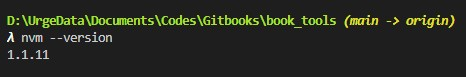
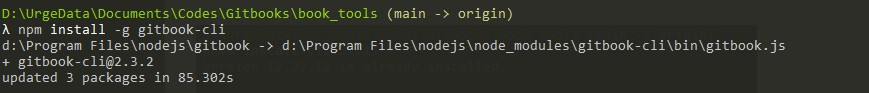
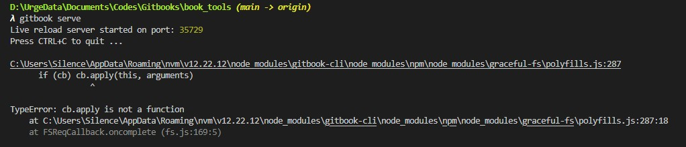
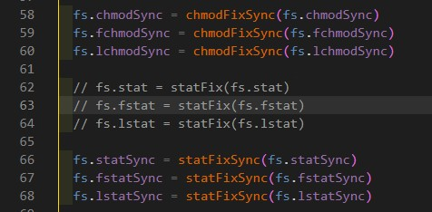

# 安装Gitbook
推荐命令行模式，即gitbook-cli版本。以下为具体安装过程。

## 安装NVM
### 什么是NVM
NVM 是 NODE.JS 的版本管理工具，通过它可以安装和切换不同版本的NODE，
从 GitHub 或者其他网站下载一个项目，我们首先查看的是当前这个项目所需要的 NODE 版本，NDOE.JS 官方版本更新的非常快，而且每一次更新改动都比较大，正是因为这个需求，才需要频繁的切换 NODE 版本。

### NVM， NODE， NPM 之间的区别
node 版本和npm包 兼容性越来越差，不同的node版本对应这不同的npm包版本。在使用node版本的过程中，版本之间的切换越来越重要。nvm是一个很好的node版本管理工具
* node: node开发环境，代码库
* npm:  安装node的时候，一起安装的，node的包管理器
* nvm:  node的版本管理工具

### NVM下载
* windows 点击[此处](https://github.com/coreybutler/nvm-windows/releases)，下载合适版本。
* mac 点击[此处](https://github.com/nvm-sh/nvm#install--update-script)
* 配置环境变量
* 验证，打开终端，输入`nvm --version`



## 使用NVM安装Node.js


### 常用命令
```
查看NVM版本信息
nvm --version
安装版本
nvm install vXX.YY.ZZ
卸载版本
nvm uninstall vXX.YY.ZZ
查看已安装版本
nvm ls
查看当前使用版本
nvm current
切换到指定版本
nvm use vXX.YY.ZZ
```

### 安装Gitbook适配的Node.js
过新的Node.js会导致gitbook生成过程报错，安装稍旧的版本就ok了。
```
nvm install v12.22.12
nvm ls
nvm use v12.22.12
```

## 安装Gitbook
终端下输入命令`npm install -g gitbook-cli`



终端下输入命令`gitbook -V`即可完成安装，但此过程一般会报错



打开报错的文件，注释掉其中的62-64行



终端下输入命令`gitbook -V`即可完成安装

