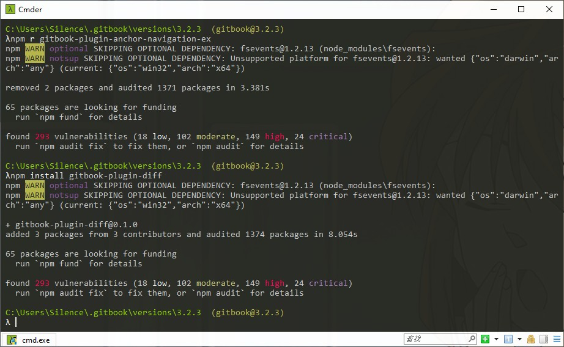

# 安装插件

推荐使用`npm`安装。

## 具体安装
打开终端，切换至gitbook的默认插件安装位置，这个位置类似于`C:\Users\Silence\.gitbook\versions\3.2.3`。

在终端下，输入命令即可安装。



## 具体安装代码
```
npm install gitbook-plugin-search-pro gitbook-plugin-back-to-top-button gitbook-plugin-code gitbook-plugin-copy-code-button 
npm install gitbook-plugin-splitter gitbook-plugin-hide-element gitbook-plugin-page-treeview gitbook-plugin-popup
npm install gitbook-plugin-expandable-chapters gitbook-plugin-chapter-fold gitbook-plugin-katex
npm install gitbook-plugin-prism gitbook-plugin-insert-logo gitbook-plugin-diff
npm install gitbook-plugin-theme-comscore
```
